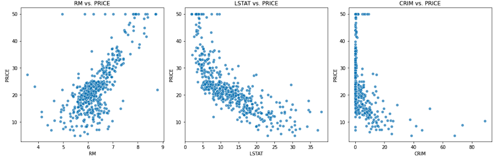

# Linear-Regression
This project uses the scikit-learn library to predict housing prices in the Boston area based on various features such as the average number of rooms per dwelling (RM), the percentage of lower-status population (LSTAT), and the crime rate (CRIM). Linear regression is employed as the predictive model.

## Chapter 1: Introduction
The "Boston Housing Prices Prediction with Linear Regression" project aims to demonstrate how to predict housing prices in the Boston area using a machine learning approach, specifically Linear Regression. We'll walk through the entire process, starting from loading the dataset, performing exploratory data analysis (EDA), building and evaluating a Linear Regression model, and finally, making predictions.

## Chapter 2: Dataset Overview
### 2.1 Dataset Description
The dataset used in this project is the "Boston Housing Prices" dataset, a classic dataset widely used in machine learning and statistics. It was collected in the 1970s and contains various factors that may influence housing prices in Boston neighborhoods. Each data point represents a different suburb, and the dataset contains 506 samples with 13 features each.

### 2.2 Features
The dataset includes features like:

CRIM: Per capita crime rate by town. \
ZN: Proportion of residential land zoned for large lots. \
INDUS: Proportion of non-retail business acres per town. \
CHAS: Charles River dummy variable (1 if tract bounds river; 0 otherwise). \
NOX: Nitrogen oxide concentration (parts per 10 million). \
RM: Average number of rooms per dwelling. \
AGE: Proportion of owner-occupied units built before 1940. \
DIS: Weighted distance to employment centers. \
RAD: Index of accessibility to radial highways. \
TAX: Property tax rate. \
PTRATIO: Pupil-teacher ratio by town. \
B: Proportion of residents of African American descent. \
LSTAT: Percentage of lower-status population. 
### 2.3 Target Variable
The target variable in this project is:

PRICE: Median value of owner-occupied homes (in thousands of dollars).
## Chapter 3: Exploratory Data Analysis (EDA)
### 3.1 Overview
Before diving into modeling, it's crucial to understand the dataset through Exploratory Data Analysis (EDA). EDA helps us identify patterns, relationships, outliers, and potential preprocessing steps. In this chapter, we'll explore the dataset using Python and various visualization techniques.

### 3.2 Summary Statistics
We start by calculating summary statistics of the dataset, including mean, standard deviation, minimum, maximum, and quartiles for each feature. This provides an initial understanding of the data's distribution and scale.

### 3.3 Correlation Analysis
To understand relationships between features, we create a correlation heatmap. The heatmap displays correlation coefficients between pairs of features. High positive or negative correlations can indicate potential multicollinearity or influential features for predicting housing prices. \

### 3.4 Feature Distributions
We visualize feature distributions by plotting histograms for key features like 'RM' (average number of rooms), 'LSTAT' (percentage of lower-status population), 'CRIM' (crime rate), and the target variable 'PRICE.' This helps us identify feature characteristics and potential outliers. \

### 3.5 Feature vs. Target Analysis
We create scatter plots of key features ('RM', 'LSTAT', 'CRIM') against the target variable 'PRICE.' These plots provide insights into the relationships between individual features and housing prices. For instance, 'RM' shows a positive correlation with price, while 'LSTAT' shows a negative correlation. \

## Chapter 4: Linear Regression Modeling
### 4.1 Introduction to Linear Regression
Linear Regression is a simple yet powerful algorithm for regression tasks. It models the relationship between a dependent variable (in this case, 'PRICE') and one or more independent variables (features) by fitting a linear equation to the observed data.

### 4.2 Data Splitting
Before building the model, we split the dataset into training and testing sets. The training set (80% of the data) is used to train the model, while the testing set (20% of the data) is used to evaluate its performance. We set a random seed to ensure reproducibility.

### 4.3 Model Building
We create an instance of the Linear Regression model using scikit-learn. The model will learn the linear relationship between the selected features ('RM', 'LSTAT', 'CRIM') and the target variable ('PRICE').

### 4.4 Model Training
The model is trained using the training dataset. During training, the algorithm adjusts its parameters to minimize the difference between the predicted and actual housing prices.

### 4.5 Model Evaluation
To assess the model's performance, we calculate two important metrics:
1. Mean Squared Error (MSE): This measures the average squared difference between predicted and actual prices. A lower MSE indicates a better-fitting model. 
2. R-squared (R2) Score: This quantifies the proportion of the variance in the target variable that is predictable from the features. A higher R2 score suggests a better model fit. 
## Chapter 5: Results and Visualization
### 5.1 Coefficients and Metrics
We print the coefficients of the trained Linear Regression model, providing insights into how each feature contributes to predicting housing prices. Additionally, we display the calculated MSE and R2 score to quantify the model's performance. 

**Linear Regression Coefficients: \
b0 = 5.59783703 \
b1 = -0.56020274 \
b2 = -0.12416262** \
**Mean Squared Error (MSE): 32.28** \
**R-squared (R2) Score: 0.56**

### 5.2 Visualization of Predictions
We create a scatter plot to visualize the relationship between actual and predicted housing prices. This plot helps us assess how well the model's predictions align with the true values, providing a visual representation of the model's performance. \

### Chapter 6: Conclusion
The "Boston Housing Prices Prediction with Linear Regression" project demonstrates a step-by-step approach to predicting housing prices using Linear Regression. It begins with data exploration and visualization, followed by model building, training, and evaluation. The project highlights the importance of EDA in understanding the dataset and selecting relevant features. The Linear Regression model provides insights into feature importance and predicts housing prices with reasonable accuracy.

This project serves as a foundational example for regression tasks, showcasing the application of machine learning to real-world datasets and the importance of data analysis in the modeling process.

### This project demonstrates the use of linear regression for predicting housing prices based on specific features and evaluates the model's performance using common regression evaluation metrics.

